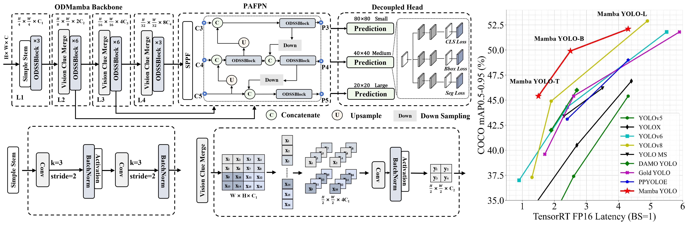

#毕业设计要求

主要研究内容
第一，设计时空混合架构，将YOLO的CNN骨干与Mamba模块深度融合，CNN提取空间局部特征，Mamba处理时序连续帧间的长程依赖，捕捉小目标的运动轨迹与上下文关联。第二，开发自适应扫描机制，针对无人机俯拍视角中目标分布稀疏的特点，让Mamba动态调整扫描路径，聚焦潜在目标区域，提升计算效率。第三，构建多尺度状态传递网络，在特征金字塔（FPN）中嵌入轻量化Mamba单元，增强不同尺度特征间的信息融合，专门优化极小目标的特征表示。第四，建立完整的评估体系，在VisDrone、UAVDT等无人机数据集上，从检测精度（特别是小目标AP）、时序一致性、推理速度等多维度验证模型效能，并进行详实的模块消融实验。

目标和要求
一、理论基础：深入理解状态空间模型（SSM）的选择性扫描机制、YOLO架构及视频目标检测特性；二、实验规范：采用固定随机种子，在相同硬件环境下进行3次重复实验取均值，与SOTA方法公平对比；三、分析深度：必须进行模块消融实验与可视化分析（如Mamba状态热力图），阐明性能增益来源；四、工程实现：提供完整训练/推理代码、详细配置文件及模型权重，确保可复现性；五、创新性：在混合架构设计、时序特征融合或扫描策略上体现明确创新点。

特色
第一，场景强驱动：摒弃通用检测框架的宽泛优化，精准锚定“无人机视频流”与“小目标”两大核心约束，使研究问题尖锐，技术设计有的放矢。第二，时空双优架构：创新性地将擅长局部感知的CNN与擅长长序列建模的Mamba有机融合，构建“空间提取-时序推理”双支路协同的混合骨干网络，同时提升单帧识别精度与帧间关联一致性。第三，动态稀疏感知：充分利用无人机视频背景相对静止、目标稀疏的特点，设计自适应的选择性扫描机制，让模型计算资源智能聚焦于运动区域，实现精度与效率的平衡。第四，端到端可部署：整个研究以实际部署为导向，模型设计兼顾精度与速度，提供从训练、验证到轻量化部署（如TensorRT）的完整技术链，确保研究成果不仅停留在论文，更具备落地应用的生命力。

成果价值
学术上，首次将Mamba架构系统性地应用于无人机视频目标检测领域，探索了状态空间模型处理视觉时序信号的潜力，为“CNN+SSM”这一新兴架构范式提供了重要的实证案例与性能基准。其提出的自适应扫描与多尺度状态传递机制，可为视频理解、长序列分析等研究方向提供新思路。工程上，直接针对无人机巡检、安防监控、智慧交通等现实场景中“小、快、密”目标检测的痛点，提供精度更高、时序更稳的解决方案。所开发的模型与优化策略，能有效提升现有无人机视觉系统的自动化水平，具有明确的产业转化前景。生态上，开源高质量的代码、训练配置与模型权重，能推动无人机视觉与高效架构研究社区的发展，促进相关技术的快速迭代与落地。
CUDA_VISIBLE_DEVICES=0 codex --auto-edit

# [AAAI2025] Mamba YOLO: A Simple Baseline for Object Detection with State Space Model

  [](README.md)


<div align="center">
  
</div>

## Model Zoo

We've pre-trained YOLO-World-T/M/L from scratch and evaluate on the `MSCOCO2017 val`. 

### Inference on MSCOCO2017 dataset


| model | Params| FLOPs | ${AP}^{val}$ | ${AP}_{{50}}^{val}$ | ${AP}_{{75}}^{val}$ | ${AP}_{{S}}^{val}$ | ${AP}_{{M}}^{val}$ | ${AP}_{{L}}^{val}$ |
| :------------------------------------------------------------------------------------------------------------------- | :------------------- | :----------------- | :--------------: | :------------: | :------------: | :------------: | :-------------: | :------------: |
| [Mamba YOLO-T](./ultralytics/cfg/models/mamba-yolo/Mamba-YOLO-T.yaml) | 5.8M | 13.2G |       44.5       |          61.2           |          48.2           |          24.7          |          48.8          |          62.0          |
| [Mamba YOLO-M](./ultralytics/cfg/models/mamba-yolo/Mamba-YOLO-B.yaml) | 19.1M | 45.4G  |       49.1       |          66.5           |          53.5           |          30.6          |          54.0          |          66.4          |
| [Mamba YOLO-L](./ultralytics/cfg/models/mamba-yolo/Mamba-YOLO-L.yaml)  | 57.6M | 156.2G |       52.1       |          69.8           |          56.5           |          34.1          |          57.3          |          68.1          |


## Getting started

### 1. Installation

Mamba YOLO is developed based on `torch==2.3.0` `pytorch-cuda==12.1` and `CUDA Version==12.6`. 

#### 2.Clone Project 

```bash
git clone https://github.com/HZAI-ZJNU/Mamba-YOLO.git
```

#### 3.Create and activate a conda environment.
```bash
conda create -n mambayolo -y python=3.11
conda activate mambayolo
```

#### 4. Install torch

```bash
pip3 install torch===2.3.0 torchvision torchaudio
```

#### 5. Install Dependencies
```bash
pip install seaborn thop timm einops
cd selective_scan && pip install . && cd ..
pip install -v -e .
```

#### 6. Prepare MSCOCO2017 Dataset
Make sure your dataset structure as follows:
```
├── coco
│   ├── annotations
│   │   ├── instances_train2017.json
│   │   └── instances_val2017.json
│   ├── images
│   │   ├── train2017
│   │   └── val2017
│   ├── labels
│   │   ├── train2017
│   │   ├── val2017
```

#### 7. Training Mamba-YOLO-T
```bash
python mbyolo_train.py --task train --data ultralytics/cfg/datasets/coco.yaml \
 --config ultralytics/cfg/models/mamba-yolo/Mamba-YOLO-T.yaml \
--amp  --project ./output_dir/mscoco --name mambayolo_n
```

## Acknowledgement

This repo is modified from open source real-time object detection codebase [Ultralytics](https://github.com/ultralytics/ultralytics). The selective-scan from [VMamba](https://github.com/MzeroMiko/VMamba).

## Citations
If you find [Mamba-YOLO](https://github.com/HZAI-ZJNU/Mamba-YOLO) is useful in your research or applications, please consider giving us a star 🌟 and citing it.

```bibtex
@misc{wang2024mambayolossmsbasedyolo,
      title={Mamba YOLO: SSMs-Based YOLO For Object Detection}, 
      author={Zeyu Wang and Chen Li and Huiying Xu and Xinzhong Zhu},
      year={2024},
      eprint={2406.05835},
      archivePrefix={arXiv},
      primaryClass={cs.CV},
      url={https://arxiv.org/abs/2406.05835}, 
}
```
